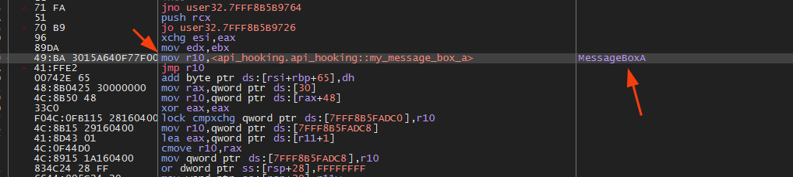

# API Hooking 🦀

API hooking in Windows, calls to these APIs are intercepted, allowing them to be monitored, modified or redirected. This is done by inserting intermediate code (the "hook") between the function call and its actual execution. When an application calls an API function, the hook is triggered first, allowing the operation to be manipulated.

## Running

Performing the API Hooking technique in MessageBoxA:


Checking the debugger for the change:


Eliminating the API hook:


Checking the debugger when disabling the hook:


## Usage 

You can run with cargo run or the compiled binary directly:
```sh
cargo run --release
```
