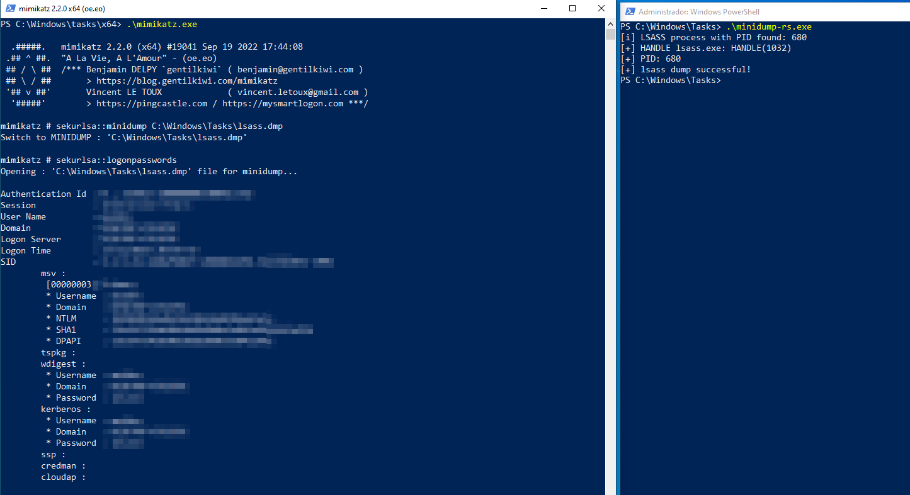

# minidump 🦀

This repository presents code written in Rust designed to dump the `lsass.exe` process.

## Running

Dumping the lsass process



## Usage

You can run with cargo run or the compiled binary directly:
```sh
cargo run --release
```
