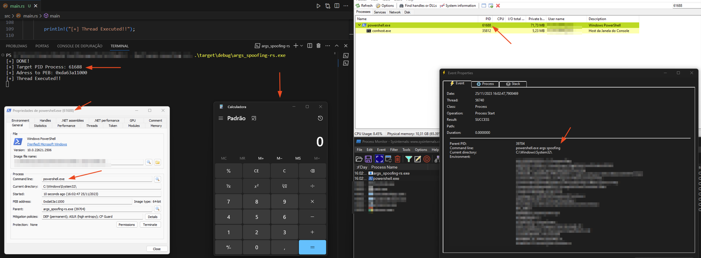

# Process Argument Spoofing 🦀

The "Process Argument Spoofing" technique involves modifying or masking the arguments passed to a process running on an operating system. The aim is to trick users, system administrators or security tools into misinterpreting the process, thinking it is harmless or legitimate, while in fact it may be carrying out malicious actions.

## Running

Showing changes to arguments in Procmon and Process Hacker.

